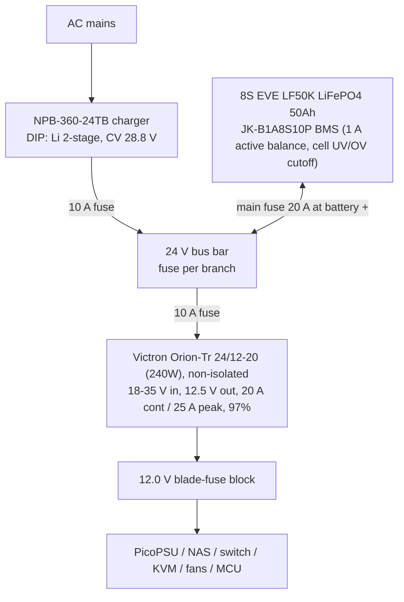

# Minirack Design

10" rack, 8U+. All internal loads on DC. Estimated draw ~50 W at the wall (~90 W peak), approx. EUR 120/yr at EUR 0.28/kWh.

## Component decisions

| Role | Choice | Notes |
|---|---|---|
| Compute | CWWK-class mini-ITX, **N100/i5-8265U** | Idle-dominated workload -> N100-class beats AMD (~EUR 42/yr + EUR 100 upfront cheaper). QuickSync for transcoding. |
| ATX supply | PicoPSU (strict 12 V version) | Fed from regulated 12.0 V bus. |
| Router | Dedicated OpenWrt device (NanoPi R-series / GL.iNet class), 12 V input | Rack is its own network, router is its root. Independent of the server: N100 can reboot without dropping VPN/network; KVM stays reachable out of band. |
| NAS | Existing DS223j | 12 V bus. Hibernates during outages (load shedding). |
| Monitoring | MCU + RTC, I2C sensors | INA226/INA3221 per rail, battery shunt (coulomb counting + mains-loss detection), AGM midpoint divider, temp/humidity, mic, IMU, diff. pressure. |

## Rack monitoring setup (and battery protection)

For reading all sensors, getting voltages, currents and power draw, controlling relays etc, we use a WT32-ETH01 micro-controller module.
The WT32 is based on the ESP32-WROOM-32 (ESP32-D0WDQ6, Xtensa dual-core 32-bit LX6 microprocessor, up to 240 MHz), and provides an ethernet port, such that the ESP stays accessible even when other components go down (except for the router).

For precise power monitoring, we use 3x ADS131M02IRUKR dual-channel ADCs @ 32MHz.
To monitor power draw at the wall, we use one of the ADCs with a CT on one channel and a PT on the other.
This allows us to measure current and voltage waveforms highly precisely, since the channels are synced.
We use a second ADC, but without transformers, on the 12V rail to get power draw and voltage stability there.
The third ADC is unused (but I added it regardless since that means the board can be used e.g. for 3-phase power monitoring purposes in other projects).
To get the battery voltage, current and power statistics, we should be able to tap into the JK BMS, and this data is also where we make the decision to dispatch a system shutdown command to the devices in case the battery level is critically low.
To prevent deep discharge, we could also add a relay that opens after the shutdown is complete.
Whether or not that disconnects *all* devices from the battery or everything but the ESP-board remains open.

The board (`eda/rack-manager`) carries the WT32-ETH01, the three ADS131M02 ADCs, a TCA9548A I2C mux and a PCA9555 GPIO expander. All three ADCs share a single `CLKIN` and are synchronized via IO15 of the ESP32. This means they are phase-locked across chips.
The clock signal comes from the LEDC output of the ESP32. Since clock stability directly impacts ADC performance, I did some tests with an ESP32 I had laying around to see how good the clock signal we produce with the ESP is. Here are the results:

This was captured on a cheap 24MHz logic analyzer.
The period histogram captures the fraction of periods measured at each whole-sample length. A clean clock collapses to a single bin, a dithered one smears across two.

| Freq set      | Window / cycles  | Avg measured | Error    | Duty   | Period histogram                       | Drop/glitch |
| ------------- | ---------------- | ------------ | -------- | ------ | -------------------------------------- | ----------- |
| **4.000 MHz** | 200 ms / 799,955 | 3.99978 MHz  | 54.8 ppm | 50.3 % | **6 smp: 99.91 %** (5:0.03, 7:0.06)    | 0 / 0       |
| 2.000 MHz     | 200 ms / 399,977 | 1.99989 MHz  | 54.8 ppm | 50.2 % | **12 smp: 99.90 %** (11:0.02, 13:0.08) | 0 / 0       |
| 8.192 MHz     | 100 ms / 819,155 | 8.19155 MHz  | 54.5 ppm | ~50 %  | 2 smp / 3 smp smeared (std 10.7 ns)    | 0 / 0       |
| 1.024 MHz     | 200 ms / 204,788 | 1.02394 MHz  | 54.6 ppm | 51.1 % | 23 smp / 24 smp (straddles 976.6 ns)   | 0 / 0       |

We'll likely go with 4MHz, which gives us a clean signal, while still allowing 32MHz captures, and thus 16MHz bandwidth on the ADC, which should be enough for harmonic analysis.

## Power architecture

24 V battery bus, charger-supplied - battery is the UPS, zero transfer time.

**Battery decision (iteration 2+):** 8S LiFePO4 from the start instead of AGM. 8x EVE LF50K 3.2 V 50Ah grade-A cells (~EUR 136) + JK BMS came in cheaper than the AGM pair and skips the mid-life battery swap. Charger sized up to NPB-360-24 so the 50Ah pack recharges in ~5 h under load (the NPB-120's ~3.4 A left under 1 A for charging after the ~2.4 A base load).

- MCU does orderly shutdown on **SOC read from the JK BMS over UART/RS485**, not a bus-voltage threshold - the LiFePO4 discharge curve is too flat for voltage triggers. BMS cell-level undervoltage cutoff is the backstop; a separate LVD module is optional.
- **Float aging caveat:** the NPB Li profile holds 28.8 V (3.6 V/cell) continuously, which ages LiFePO4 held at full. Prefer the programmable variant (SBP-001 / CANbus) set to ~27.6 V (3.45 V/cell), or mitigate via BMS charge cutoff.
- Star wiring from bus bar, not stacked lugs; 2.5 mm2 branches. Top-balance cells before first assembly; compression fixture for the prismatic pack.
- Runtime: ~27 h full load / ~38 h shed (50Ah); router stays powered in shed mode (VPN up during outages). Wall-to-device efficiency ~86 %; on battery ~94 % (no inverter).

## 3V3 rail power budget

The MCU peripherals run off the WT32-ETH01's onboard 3.3 V LDO. Combined draw is small enough that the rail is a non-issue.

| Load | Count | Per-device (max) | Subtotal |
|---|---|---|---|
| ADS131M02 ADC (HR mode) | 3 | 2.15 mA AVDD + 0.35 mA DVDD = 2.5 mA | 7.5 mA |
| TCA9548A I2C mux | 1 | ~35 uA operating | ~0.1 mA |
| AHT20+BMP280 boards | 8 | ~uA idle, ~0.7-1 mA the one channel being read | ~2-8 mA |
| I2C pull-ups (main + active channel) | - | ~0.33 mA per pulled-low line | ~1-2 mA |
| **Total** | | | **~12-30 mA** |

## Upgrade paths

- **Solar:** MPPT controller onto the 24 V bus
- **PoE**
