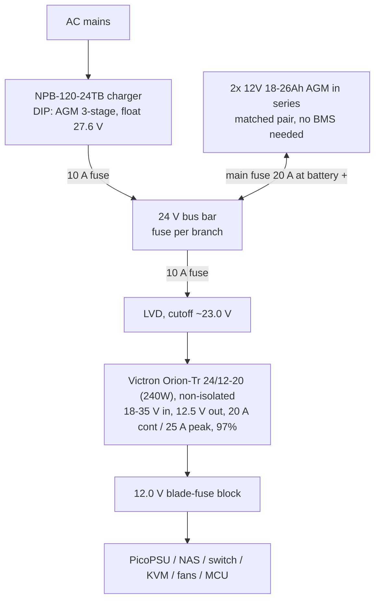

# Minirack Design

10" rack, 8U+. All internal loads on DC. Estimated draw ~50 W at the wall (~90 W peak), approx. EUR 120/yr at EUR 0.28/kWh.

## Component decisions

| Role | Choice | Notes |
|---|---|---|
| Compute | CWWK-class mini-ITX, **N100/i5-8265U** | Idle-dominated workload -> N100-class beats AMD (~EUR 42/yr + EUR 100 upfront cheaper). QuickSync for transcoding. |
| ATX supply | PicoPSU (strict 12 V version) | Fed from regulated 12.0 V bus. |
| Router | Dedicated OpenWrt device (NanoPi R-series / GL.iNet class), 12 V input | Rack is its own network, router is its root. Independent of the server: N100 can reboot without dropping VPN/network; KVM stays reachable out of band. |
| NAS | Existing DS223j | 12 V bus. Hibernates during outages (load shedding). |
| Switch | 8-port non-PoE, 12 V input | PoE via individual 12->48 V 802.3af injectors only where needed (Meshtastic runs off 12 V directly). |
| KVM | JetKVM/PiKVM class | Reachable via router/VPN even while the server is down. |
| Monitoring | MCU + RTC, I2C sensors | INA226/INA3221 per rail, battery shunt (coulomb counting + mains-loss detection), AGM midpoint divider, temp/humidity, mic, IMU, diff. pressure. |

## Power architecture

24 V float-charged battery bus - battery is the UPS, zero transfer time.

- MCU does orderly shutdown at ~24.2 V bus, long before the LVD trips.
- Star wiring from bus bar, not stacked lugs; 2.5 mm2 branches; battery replaced as a matched pair when float voltages drift >0.2-0.3 V apart.
- Runtime v1: ~6 h shed (18Ah) / ~9 h (26Ah); router stays powered in shed mode (VPN up during outages). Wall-to-device efficiency ~86 %; on battery ~94 % (no inverter).

## Upgrade paths (architecture stays fixed)

- **Battery:** AGM -> 24 V (8S) LiFePO4 50Ah (~EUR 300) when logs show runtime is insufficient. Flip charger DIP to Li 2-stage. 50Ah gives ~27 h full load / ~38 h shed. Never series two 12 V lithium packs.
- **Solar:** MPPT controller straight onto the 24 V bus.
- **PoE at scale:** only if many loads - would justify native 48 V instead of injectors.

## Shopping list (power system v1)

- Mean Well NPB-120-24**TB** - EUR 55-75 at TME/Reichelt (not Amazon)
- 2x identical 12 V 18-26Ah AGM (same batch) - EUR 60-90
- **Victron Orion-Tr 24/12-20 (240W), non-isolated** (`ORI241220200`) - EUR 90-110 at TME/Reichelt. 18-35 V in covers the 20-30 V bus (and the 8S LiFePO4 upgrade path); fixed 12.5 V out sits safely under the PicoPSU's ~13-13.5 V OV shutdown; 97% synchronous buck-boost, no fan. Not the Mean Well SD-350B-12 (80%, built-in fan) or the isolated Orion-Tr (~87%, isolation not needed on a common battery-negative bus).
- Optional at the 12 V blade-fuse block input: 1000-2200 uF low-ESR electrolytic + 100 nF, as ripple/inrush insurance.
- LVD module (or Victron BatteryProtect)
- MIDI fuse + holder (20 A), blade-fuse block, 2.5 mm2 wire, lugs + hex crimper
- 5 V wall wart -> GPIO as mains-present detector
