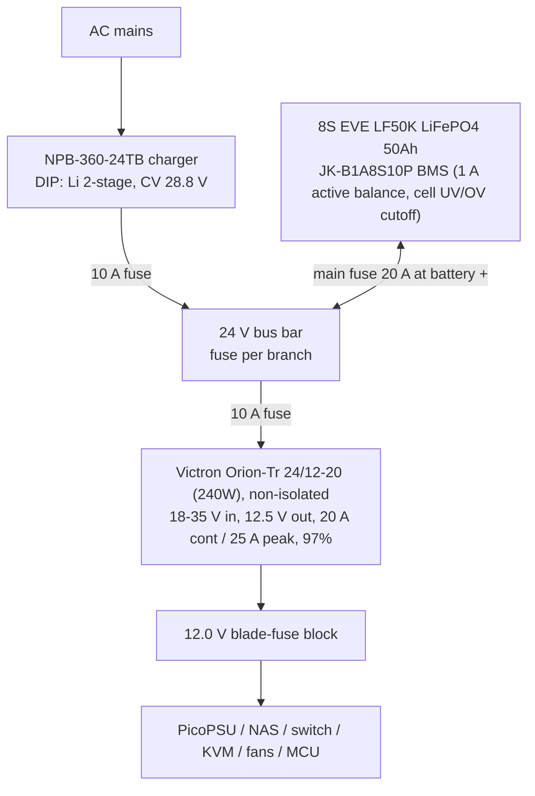

# Minirack Design

10" rack, 8U+. All internal loads on DC. Estimated draw ~50 W at the wall (~90 W peak), approx. EUR 120/yr at EUR 0.28/kWh.

## Component decisions

| Role | Choice | Notes |
|---|---|---|
| Compute | CWWK-class mini-ITX, **N100/i5-8265U** | Idle-dominated workload -> N100-class beats AMD (~EUR 42/yr + EUR 100 upfront cheaper). QuickSync for transcoding. |
| ATX supply | PicoPSU (strict 12 V version) | Fed from regulated 12.0 V bus. |
| Router | Dedicated OpenWrt device (NanoPi R-series / GL.iNet class), 12 V input | Rack is its own network, router is its root. Independent of the server: N100 can reboot without dropping VPN/network; KVM stays reachable out of band. |
| NAS | Existing DS223j | 12 V bus. Hibernates during outages (load shedding). |
| Switch | 8-port non-PoE, 12 V input | PoE via individual 12->48 V 802.3af injectors only where needed (Meshtastic runs off 12 V directly). |
| KVM | JetKVM/PiKVM class | Reachable via router/VPN even while the server is down. |
| Monitoring | MCU + RTC, I2C sensors | INA226/INA3221 per rail, battery shunt (coulomb counting + mains-loss detection), AGM midpoint divider, temp/humidity, mic, IMU, diff. pressure. |

## Power architecture

24 V battery bus, charger-supplied - battery is the UPS, zero transfer time.

**Battery decision (iteration 2+):** 8S LiFePO4 from the start instead of AGM. 8x EVE LF50K 3.2 V 50Ah grade-A cells (~EUR 136) + JK BMS came in cheaper than the AGM pair and skips the mid-life battery swap. Charger sized up to NPB-360-24 so the 50Ah pack recharges in ~5 h under load (the NPB-120's ~3.4 A left under 1 A for charging after the ~2.4 A base load).

- MCU does orderly shutdown on **SOC read from the JK BMS over UART/RS485**, not a bus-voltage threshold - the LiFePO4 discharge curve is too flat for voltage triggers. BMS cell-level undervoltage cutoff is the backstop; a separate LVD module is optional.
- **Float aging caveat:** the NPB Li profile holds 28.8 V (3.6 V/cell) continuously, which ages LiFePO4 held at full. Prefer the programmable variant (SBP-001 / CANbus) set to ~27.6 V (3.45 V/cell), or mitigate via BMS charge cutoff.
- Star wiring from bus bar, not stacked lugs; 2.5 mm2 branches. Top-balance cells before first assembly; compression fixture for the prismatic pack.
- Runtime: ~27 h full load / ~38 h shed (50Ah); router stays powered in shed mode (VPN up during outages). Wall-to-device efficiency ~86 %; on battery ~94 % (no inverter).

## Monitoring 3V3 rail budget (WT32-ETH01)

The MCU peripherals run off the WT32-ETH01's onboard 3.3 V LDO. Combined draw is small enough that the rail is a non-issue.

| Load | Count | Per-device (max) | Subtotal |
|---|---|---|---|
| ADS131M02 ADC (HR mode) | 3 | 2.15 mA AVDD + 0.35 mA DVDD = 2.5 mA | 7.5 mA |
| TCA9548A I2C mux | 1 | ~35 µA operating | ~0.1 mA |
| AHT20+BMP280 boards | 8 | ~µA idle, ~0.7-1 mA the one channel being read | ~2-8 mA |
| I2C pull-ups (main + active channel) | - | ~0.33 mA per pulled-low line | ~1-2 mA |
| **Total** | | | **~12-30 mA** |

- Mux switches the I2C **bus only, not power** - all 8 sensor boards are powered continuously, but only the selected channel's sensor converts at a time; the other 7 sit at idle (~µA).
- WT32-ETH01 baseline (ESP32 + LAN8720 PHY) is ~150-200 mA; even a 500 mA-class onboard LDO leaves ~300 mA headroom, ~10x what these peripherals need. Wired Ethernet only - keep the WiFi radio off so the ESP32 doesn't spike the LDO's total budget with ~500 mA TX bursts.
- **Check the specific AHT20+BMP280 module:** bare variants (native 3.3 V, 2 pull-ups) draw ~µA idle; variants with a power LED add ~1-2 mA each (~10-16 mA for 8), and variants with an onboard 5->3.3 V LDO should be fed from 5 V instead of the WT32's 3V3 rail. Add a bulk cap near the sensor cluster for the 8x decoupling-cap inrush at power-up.

## Upgrade paths (architecture stays fixed)

- **Solar:** MPPT controller straight onto the 24 V bus.
- **PoE at scale:** only if many loads - would justify native 48 V instead of injectors.

## Shopping list (power system v1)

Full costed list: components.ods, **Iteration 5** (~EUR 1,096 all-in incl. compute/rack/network).

- Mean Well NPB-360-24**TB** - ~EUR 100 at TME/Reichelt (not Amazon); programmable variant preferred (see float caveat above)
- 8x EVE LF50K LiFePO4 3.2 V 50Ah, grade A, same batch - ~EUR 136
- JK BMS JK-B1A8S10P (1 A active balance, UART/RS485 for MCU SOC readout) - ~EUR 40
- Cell compression fixture + pack hardware (busbars usually ship with the cells)
- **Victron Orion-Tr 24/12-20 (240W), non-isolated** (`ORI241220200`) - EUR 90-110 at TME/Reichelt; verify cheap listings aren't the 120W model. 18-35 V in covers the 8S LiFePO4 bus; fixed 12.5 V out sits safely under the PicoPSU's ~13-13.5 V OV shutdown; 97% synchronous buck-boost, no fan. Not the Mean Well SD-350B-12 (80%, built-in fan) or the isolated Orion-Tr (~87%, isolation not needed on a common battery-negative bus).
- Optional at the 12 V blade-fuse block input: 1000-2200 uF low-ESR electrolytic + 100 nF, as ripple/inrush insurance.
- Optional LVD module (or Victron BatteryProtect) - BMS cell UV cutoff already covers this
- MIDI fuse + holder (20 A), blade-fuse block, 2.5 mm2 wire, lugs + hex crimper
- 5 V wall wart -> GPIO as mains-present detector
