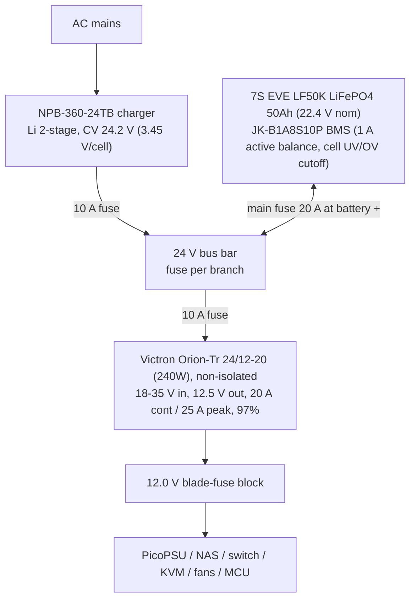

# Minirack Design

10" rack, 8U+. All internal loads on DC. Estimated draw ~50 W at the wall (~90 W peak), approx. EUR 120/yr at EUR 0.28/kWh.

## Component decisions

| Role | Choice | Notes |
|---|---|---|
| Compute | CWWK-class mini-ITX, **N100/i5-8265U** | Idle-dominated workload -> N100-class beats AMD (~EUR 42/yr + EUR 100 upfront cheaper). QuickSync for transcoding. |
| ATX supply | PicoPSU (strict 12 V version) | Fed from regulated 12.0 V bus. |
| Router | Dedicated OpenWrt device (NanoPi R-series / GL.iNet class), 12 V input | Rack is its own network, router is its root. Independent of the server: N100 can reboot without dropping VPN/network; KVM stays reachable out of band. |
| NAS | Existing DS223j | 12 V bus. Hibernates during outages (load shedding). |
| Monitoring | MCU + RTC, 3x ADS131M02 ADCs + I2C sensors | Synced ADCs: wall (CT+PT), 12V rail, 24V bus (high-side shunt+INA240 / dividers). Battery V/I/SOC from JK BMS over RS485. Temp/humidity, mic, IMU, diff. pressure over I2C. |

## Rack monitoring setup (and battery protection)

For reading all sensors, getting voltages, currents and power draw, controlling relays etc, we use a WT32-ETH01 micro-controller module.
The WT32 is based on the ESP32-WROOM-32 (ESP32-D0WDQ6, Xtensa dual-core 32-bit LX6 microprocessor, up to 240 MHz), and provides an ethernet port, such that the ESP stays accessible even when other components go down (except for the router).

For precise power monitoring, we use 3x ADS131M02IRUKR dual-channel ADCs @ 32MHz.
To monitor power draw at the wall, we use one of the ADCs with a CT on one channel and a PT on the other.
This allows us to measure current and voltage waveforms highly precisely, since the channels are synced.
The other two ADCs monitor the DC rails (see below). Battery pack V/I/SOC come from the JK BMS over RS485, so the ADCs don't duplicate it.

### DC rail monitoring

The wall CT/PT are transformer-isolated, so ADC1 floats free of the board ground. The DC rails don't have that luxury: the Orion-Tr buck is **non-isolated**, so the 24V bus GND, the 12V rail GND and the board AGND are all one node. The ADS131M02 inputs only accept AGND-1.3V ... AVDD (~3.3V), so a shunt in the **+12V or +24V line** (common-mode 12-28V) can't be wired straight into the ADC - high-side sensing there would need a current-sense amplifier (INA240 etc.) or a discrete level-shifter to translate the bus common-mode down to ground. We sidestep that entirely:

- **12V rail current -> low-side, ampless.** A 1 mΩ shunt in the 12V **return**. Both terminals sit within a few mV of ground, so it feeds the ADS **directly, no amplifier**, on the **gain-32 PGA**. The ADS's own ~±35 µV offset beats any cheap discrete amp we'd otherwise build.
- **24V bus current -> derived, not measured.** bus current ≈ P12 / (V_bus · η_buck) from the measured 12V rail power and the measured bus voltage (η ≈ 0.97). This drops the one channel that would have needed a high-common-mode amp; buck efficiency and pack-side DC load still fall out of it.
- **Both rail voltages -> resistor dividers** to GND (voltage sensing is inherently ground-referenced, so no amp, ever).

Battery internals stay with the BMS; we only instrument the aggregate rails, not per-device branches.

| ADC  | Ch  | Signal           | Front end                                 | PGA gain | Full scale at that gain      |
| ---- | --- | ---------------- | ----------------------------------------- | -------- | ---------------------------- |
| ADC1 | 0   | Wall current     | CT + burden (transformer-isolated)        | 1*       | size burden -> ~1.0V at max  |
| ADC1 | 1   | Wall voltage     | PT + divider (isolated)                   | 1*       | ~1.0V at 325V pk             |
| ADC2 | 0   | 12V rail voltage | divider ~11.5k/1k (÷12.5), Thevenin ~0.9k | 1        | 15V -> 1.2V (12V -> 0.96V)   |
| ADC2 | 1   | 12V rail current | **low-side 1 mΩ shunt, direct to ADC**    | **32**   | 25A -> 25mV (FSR ±37.5mV)    |
| ADC3 | 0   | 24V bus voltage  | divider ~26k/1k (÷27), Thevenin ~1k       | 1        | 32V -> 1.2V (25.6V -> 0.95V) |
| ADC3 | 1   | 24V bus current  | *derived - channel unused*                | -        | -                            |

*Wall gains assume the burden/PT are scaled so peak lands at ~1V; raise the PGA if the transformer output is smaller.

Design notes:
- **Gain strategy:** FSR = ±1.2 V / gain. Fill the range in the front end and keep the PGA at **gain=1** (best dynamic range for a range-filling signal). The low-side shunt is the deliberate exception: its raw 20 mV (20A) / 25 mV (25A peak) is tiny, so **gain=32** (FSR ±37.5 mV, ~53-67% used) recovers the SNR the amp would have. General rule: highest gain where `Imax · Rshunt < 0.9 · FSR` (e.g. a 2 mΩ shunt -> gain=16).
- **Global-chop mode** (`GC_EN`, per-chip) nulls the ADC's internal offset/drift and improves noise by √2. **Chop ON for all three.** Note: chop fixes only the ADC's own offset, not external front-end offset - a zero-cal is still needed for that.
  - *Correction to an earlier assumption here:* chop does **not** halve the data rate. Datasheet eq. 8 gives `tGC_CONVERSION = tGC_DLY + 3 × OSR × tMOD` - three times OSR, because reversing the input polarity is a step change the sinc³ filter needs three conversion periods to settle out of. At OSR 64 + default `GC_DLY` that is 104 µs, so **9.6 kSPS**, not 15.6.
  - Chop at 31.25 kSPS is unreachable at any legal clock: `3 × OSR` bottoms out at 192 tMOD and CLKIN is capped near 10.2 MHz by `tw(CLH)`/`tw(CLL)` ≥ 49 ns. So the choice was chop-everywhere at 9.6 kSPS or chop-nowhere at 31.25 kSPS. We took quality: it's a power meter, not an oscilloscope.
  - 9.6 kSPS is 192 samples per 50 Hz cycle, Nyquist at the 96th harmonic - roughly 2× the margin IEC 61000-4-7 asks for (50th). The earlier worry about "full rate for wall harmonics" on ADC1 was unfounded.
  - Uniform settings are also what keeps the three conversion periods equal, so ADC1's DRDY (the only one wired) speaks for all three. Splitting chop or OSR across chips breaks that.
- **Low-side placement + caveat:** put the shunt at the single 12V-return junction (buck output return -> star ground). It lifts the 12V loads' ground ~20 mV (negligible). It is vulnerable to **ground-loop bypass** if a 12V load has an alternate return to the star point (e.g. chassis bonding), so keep 12V returns star-wired *through* the shunt. A dead short would push the shunt node toward 12V, but that's a fuse event, not normal operation.
- **Bus divider headroom:** sized when the pack was 8S (28.8 V -> 1.07 V of the 1.2 V FSR). At 7S the bus peaks at 25.6 V -> ~0.95 V, so slightly less of the range is used. Harmless, and the boards are already manufactured.
- **Dividers deliberately low-impedance** (Thevenin ~1k). ADS Zin at gain 1-4 is `330 kΩ × 4.096 MHz / fMOD` = ~676 kΩ at 4 MHz CLKIN (fMOD = 2 MHz), so ~0.15% loading error; calibrate the exact ratio in firmware. Bleed ~1 mA / ~30 mW per divider.
- **Calibration:** two-point (zero + known load) in firmware for the shunt channel. With gain=32 + global-chop the ADC's own contribution is negligible, so the shunt tolerance/tempco and the cal dominate accuracy.
- **Anti-alias:** the existing 1k + 10nF input RC sets a ~16 kHz corner. Captures 100/120 Hz ripple, load-step droop and the mains-loss -> battery sag envelope, but **not** the buck's ~500 kHz switching ripple.
  - *The RC is sized against fMOD, not the data rate.* Calling the corner "coherent with ~32 kSPS" was a loose way to put it. A ΔΣ samples at the modulator, `fMOD = CLKIN/2 = 2 MHz`; that is the only place true, unrecoverable aliasing happens, and the RC gives ~-42 dB there. Since fMOD is fixed by CLKIN, **the RC does the same job at 9.6 kSPS as at 32 kSPS** - dropping the data rate did not invalidate it, which matters now that the boards are manufactured and the RC can't be changed.
  - Everything between the output band and fMOD is the decimation filter's job. The sinc³ places its nulls at multiples of the output rate, which is exactly where the fold-in bands sit, so worst case is its sidelobe structure: ~-40 dB (sinc's -13.3 dB first sidelobe, cubed). That figure is scale-invariant - the nulls move with the rate - so the lower output rate does not erode it.
  - Net cost of 9.6 vs 32 kSPS is one fold band (9.6 kHz) landing below the RC corner, where the RC contributes ~1.5 dB instead of ~6 dB. A few dB, on one band.
  - **Watch for:** the buck's ~500 kHz ripple is attenuated ~30 dB by the RC but not eliminated, and it is a high multiple of 9.6 kHz, so the residue folds into the measurement band. The Orion-Tr is not locked to our CLKIN, so the fold position drifts with load and temperature - expect a *wandering* low-frequency artifact on ADC2 rather than a fixed tone, and don't mistake it for real load variation. Averaging over a mains cycle (which the power computation does anyway) knocks it down further.
- Being on the same phase-locked ADCs, the 12V sag can be correlated against the wall event in one timebase - useful for outage-handoff analysis.
To get the battery voltage, current and power statistics, we should be able to tap into the JK BMS, and this data is also where we make the decision to dispatch a system shutdown command to the devices in case the battery level is critically low.
To prevent deep discharge, we could also add a relay that opens after the shutdown is complete.
Whether or not that disconnects *all* devices from the battery or everything but the ESP-board remains open.

The board (`eda/rack-manager`) carries the WT32-ETH01, the three ADS131M02 ADCs, a TCA9548A I2C mux and a PCA9555 GPIO expander. All three ADCs share a single `CLKIN` and are synchronized via IO15 of the ESP32. This means they are phase-locked across chips.
The clock signal comes from the LEDC output of the ESP32. Since clock stability directly impacts ADC performance, I did some tests with an ESP32 I had laying around to see how good the clock signal we produce with the ESP is. Here are the results:

This was captured on a cheap 24MHz logic analyzer.
The period histogram captures the fraction of periods measured at each whole-sample length. A clean clock collapses to a single bin, a dithered one smears across two.

| Freq set      | Window / cycles  | Avg measured | Error    | Duty   | Period histogram                       | Drop/glitch |
| ------------- | ---------------- | ------------ | -------- | ------ | -------------------------------------- | ----------- |
| **4.000 MHz** | 200 ms / 799,955 | 3.99978 MHz  | 54.8 ppm | 50.3 % | **6 smp: 99.91 %** (5:0.03, 7:0.06)    | 0 / 0       |
| 2.000 MHz     | 200 ms / 399,977 | 1.99989 MHz  | 54.8 ppm | 50.2 % | **12 smp: 99.90 %** (11:0.02, 13:0.08) | 0 / 0       |
| 8.192 MHz     | 100 ms / 819,155 | 8.19155 MHz  | 54.5 ppm | ~50 %  | 2 smp / 3 smp smeared (std 10.7 ns)    | 0 / 0       |
| 1.024 MHz     | 200 ms / 204,788 | 1.02394 MHz  | 54.6 ppm | 51.1 % | 23 smp / 24 smp (straddles 976.6 ns)   | 0 / 0       |

We'll likely go with 4MHz, which gives us a clean signal, while still allowing 32MHz captures, and thus 16MHz bandwidth on the ADC, which should be enough for harmonic analysis.

## Power architecture

24 V battery bus, charger-supplied - battery is the UPS, zero transfer time.

**Battery decision (iteration 2+):** LiFePO4 from the start instead of AGM. EVE LF50K 3.2 V 50Ah grade-A cells (~EUR 136) + JK BMS came in cheaper than the AGM pair and skips the mid-life battery swap. Charger sized up to NPB-360-24 so the 50Ah pack recharges in ~5 h under load (the NPB-120's ~3.4 A left under 1 A for charging after the ~2.4 A base load).

**Revised to 7S (iteration 3):** eight cells plus the BMS do not physically fit the 10" enclosure. Dropped to 7S, which the BMS supports natively. Costs 12.5 % of the energy and nothing else. Full pack detail, wiring, charger setup and commissioning live in [`bms/README.md`](../bms/README.md).

- MCU does orderly shutdown on **SOC read from the JK BMS over UART/RS485**, not a bus-voltage threshold - the LiFePO4 discharge curve is too flat for voltage triggers. BMS cell-level undervoltage cutoff is the backstop; a separate LVD module is optional.
- **The Orion-Tr's 18 V input floor is the binding low-end constraint at 7S.** It corresponds to 2.57 V/cell (at 8S it was 2.25 V/cell, which never mattered). The BMS UV cutoff must stay above ~2.6 V/cell or the 12 V rail dies from buck dropout *before* the BMS protects. The planned 2.8-3.0 V/cell clears it, but the margin is thinner than the 8S design assumed - see `bms/README.md`.
- **Float aging caveat:** the NPB Li profile's DIP default is 28.8 V, which is 8S-specific and would be 4.11 V/cell at 7S. CV is set by pot to **24.2 V (3.45 V/cell)**, which also avoids holding the pack at full continuously.
- Star wiring from bus bar, not stacked lugs; 2.5 mm2 branches. Inter-cell links are wire, not busbar, sized to the BMS's 100 A ceiling. Top-balance cells before first assembly; compression fixture for the prismatic pack.
- Runtime: ~24 h full load / ~33 h shed (7S, 50Ah, 1.12 kWh); router stays powered in shed mode (VPN up during outages). Wall-to-device efficiency ~86 %; on battery ~94 % (no inverter).

## 3V3 rail power budget

The MCU peripherals run off the WT32-ETH01's onboard 3.3 V LDO. Combined draw is small enough that the rail is a non-issue.

| Load | Count | Per-device (max) | Subtotal |
|---|---|---|---|
| ADS131M02 ADC (HR mode) | 3 | 2.15 mA AVDD + 0.35 mA DVDD = 2.5 mA | 7.5 mA |
| TCA9548A I2C mux | 1 | ~35 uA operating | ~0.1 mA |
| AHT20+BMP280 boards | 8 | ~uA idle, ~0.7-1 mA the one channel being read | ~2-8 mA |
| I2C pull-ups (main + active channel) | - | ~0.33 mA per pulled-low line | ~1-2 mA |
| **Total** | | | **~12-30 mA** |

## Upgrade paths

- **Solar:** MPPT controller onto the 24 V bus
- **PoE**
