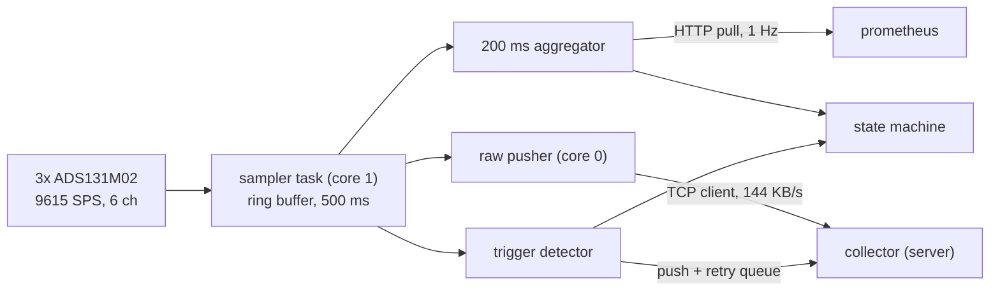
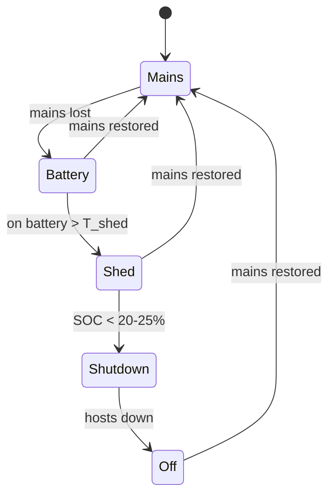

# Rack Manager: Features and Responsibilities

What the WT32-ETH01 board (`eda/rack-manager`, firmware in `rack-manager/firmware`) is
responsible for, and what it deliberately is not. Hardware decisions live in
`design.md`; this document is about the application built on top of the drivers.

## Split of responsibilities

The board is the only thing in the rack that survives every failure mode: it is on the
battery, it has its own ethernet, and it keeps running when the server, the router and
the mains are all gone. That, and nothing else, decides what belongs on it.

**The ESP owns:**

- All sampling and all real-time measurement. Nothing else has access to the ADCs.
- The safety state machine: outage detection, load shedding, orderly shutdown, alarms.
  It runs standalone and correctly with the network down.
- Actuation: relays, ATX power signalling, front-panel LED and buzzer.
- Environment sensing and the sensor-position metadata that describes it.

**The ESP does not own:**

- History. It has no RTC, no SD card, and 4 MB of flash split A/B.
- The GUI. Each app slot is under 2 MB; a 3D rack view and FFT plots do not fit next to
  the firmware, and there is no PSRAM on the WT32.
- Harmonic analysis, long-window statistics, anything that wants floating-point
  comfort or a plotting library.

Everything in the second list goes to the collector on the rack's own server.

## Constraints that shape all of it

Three hard limits, worth stating once:

**I/O budget is exhausted.** IO36 is the PCA9555 nINT (`gpioexp.cpp`); every other ESP
pin is ADC or ethernet PHY. The entire remaining external I/O is:

| Resource | What it is | Assigned to |
|---|---|---|
| 16 expander pins | J24 / J25, via PCA9555 | relays, button, LED, buzzer, ATX sense |
| UART0 (IO1/IO3) | on programming header J11 | RS485 to the JK BMS |
| Spare I2C | J13, main bus | IMU, diff. pressure, optional LCD |
| 8 mux channels | J16-J23, behind TCA9548A | temp/humidity/pressure |

There is no free analog pin, so the wishlist microphone has nowhere to go. The IMU
covers most of what it was wanted for.

This is close to fully used but not cramped: 7 expander pins stay spare, and the I2C bus
is idle most of the time (see *Headroom* at the end).

**No RTC.** Time comes from NTP. See *Timebase* below - the conclusion is that the rack
server, not a chip, is the right clock.

**Sample rate is 9615 SPS, fixed.** OSR 64 + global chop on all three chips gives
`tGC = 8 us + 3 x 64 x 0.5 us = 104 us`. All six channels are phase-locked.

## 1. Power measurement

### Sampling

| | |
|---|---|
| Frame period | 104 us -> **9615 SPS**, six channels simultaneous |
| Samples per 50 Hz cycle | 192.3 |
| Nyquist | 4.8 kHz = 96th harmonic |
| Front-end bandwidth | ~16 kHz (1k + 10nF RC) |
| Actual rate | ~9616 SPS; CLKIN measures 54.8 ppm fast (`design.md`) |

One dedicated task pinned to core 1, driven by ADC1's DRDY, calls `adcReadSampleAll()`.
Cost is 36 bytes at 12 MHz = 24 us per 104 us frame, ~23 % duty. Core 0 keeps the
network stack. The sampler must never block: it writes into a bounded ring and drops
oldest on overrun, recording the gap.

### Timebase

The **sample counter is the primary timebase**, not `millis()` and not NTP time. It is
monotonic, exact, and locked to CLKIN. Every stream packet carries the sample index of
its first sample. Separately, the ESP publishes `sample_index <-> UTC` anchors as a slow
stream.

**Absolute time comes from the rack server, not from a chip.** The obvious worry is that
NTP is unreachable during a mains outage, since the ISP's equipment is not battery
backed - but that argues for a local time source, not an RTC. The server is on the
rack's own network and on the battery, so chrony running there is reachable throughout
an outage, with internet NTP only as its upstream. The collector already holds a
connection to the ESP and can push time on connect as a second path.

An RTC would only close one narrow gap: an ESP reboot while the internet is down, after
which events would carry no absolute timestamp until resync. The local NTP server closes
that same gap with no parts. During the outage itself the ESP does not need to resync at
all - its own crystal drifts ~36 ms/hour, which is nothing next to the events being
timed.

If an RTC is fitted anyway it costs one I2C address on J13 and does no harm; a DS3231 is
a +/-2 ppm TCXO and would be a better frequency reference than the LEDC clock. It is an
upgrade, not a requirement.

The clock accuracy question is separate and does matter. The 54.8 ppm CLKIN error is 4.7
s/day of drift, and
bounds frequency measurement directly: 55 ppm on 50 Hz is +/-2.75 mHz. Regression of the
anchors over hours recovers the true sample rate and takes that well under a mHz, which
is what makes ROCOF meaningful rather than decorative. Anchors also let the collector
place an outage on an absolute timeline after the fact, without the ESP ever needing to
know the time when it happened.

### Derived metrics

Computed on the ESP, per 200 ms block (10 cycles at 50 Hz, the IEC 61000-4-30 base):

- Vrms, Irms, **P** = mean(u.i), S = Vrms.Irms, **Q** = sqrt(S^2 - P^2), PF = P/S
- displacement PF (cos phi of the fundamental), crest factor, peak V and I, DC offset
- **frequency** from interpolated zero crossings, and **ROCOF** (df/dt)
- energy accumulators -> kWh, persisted to NVS periodically

Per half-cycle (10 ms), refreshed every half-cycle: **RMS for event detection**. This is
the IEC 61000-4-30 method, and the input to sag/swell/interruption classification
(<90 %, >110 %, <5 %).

DC side, same timebase and same blocks: P12 = V12.I12, 12 V ripple (the 100 Hz
component), load-step droop, 24 V bus voltage, derived bus current
(`P12 / (V_bus . eta)`, `design.md`), and buck efficiency as a health signal.

Because all six channels share one clock, the 12 V sag and the wall event sit on the
same axis to the sample. That correlation is the point of the whole synchronised
front end.

### What this cannot see

The front-end RC corners at 16 kHz, so measurements are **envelopes, not spikes**. The
sub-millisecond shape of a voltage collapse is in band; a microsecond surge transient is
not, and no amount of firmware recovers it. Do not present the system as surge
detection.

Also, per `design.md`: the Orion-Tr's ~500 kHz switching residue aliases into the
measurement band on ADC2, and because the buck is not locked to CLKIN, its fold position
**wanders with load and temperature**. Any anomaly detector on the 12 V rail must not
learn this as a fault.

## 2. Data plane

Three tiers, three transports, deliberately independent so that one failing does not
take the others with it.



| Tier | Rate | Transport | Direction | Retention |
|---|---|---|---|---|
| Raw waveform | 9615 Hz, 5 ch | binary over TCP | collector dials in | collector ring |
| Aggregates | 5 Hz blocks, 1 Hz rollup | HTTP `/metrics` | collector scrapes | forever |
| Events | on trigger | JSON push + retry queue | ESP dials out | forever |

### Raw stream

The ESP is a TCP **server**: it listens on `ADC_STREAM_PORT`, the collector finds it by
browsing `_easyota._tcp` (the same record `flash.sh` uses) and dials in, and the ESP then
pushes continuously into the accepted socket. Neither end stores the other's address, so
a DHCP lease or a rename cannot break the link; the retry and backoff therefore live on
the collector, which is the end doing the finding. All five live channels, always. ADC3
ch1 is unused (bus current is derived).

```
  u32 magic
  u32 first_sample_idx
  u16 n_frames
  u8  ch_mask
  u8  flags          bit 0: gap precedes this packet
  [ int24 x 5 ] * n_frames
```

15 bytes per frame, so a 1460-byte MTU carries ~96 frames = one packet per 10 ms.

| | |
|---|---|
| Sustained | **144 KB/s = 1.2 Mbit/s** (~10 % of what the LAN8720 path delivers) |
| Per day | **12.5 GB** |
| ESP ring | 500 ms = 72 KB (1 s = 144 KB, more than reliably free next to lwIP) |

Backpressure is handled by dropping, never by blocking. A gap is always self-describing:
the sample index jumps and the flag is set, so the collector can distinguish lost data
from a quiet line.

**Retention is the collector's problem, and it is a real one.** 12.5 GB/day is ~375
GB/month, which the DS223j will not hold for long. The collector keeps a rolling raw
ring (hours, not months) and permanently promotes only event windows. Aggregates are
small enough to keep forever (~130 MB/day of JSON, far less as time series).

### Why aggregates are pulled, not pushed

A collector reboot is a 60 s hole, and the 500 ms ESP ring does not cover it. If
aggregates shared the raw connection they would be lost in the same window. Prometheus
scraping an ESP-side `/metrics` endpoint survives independently, and events are queued
in RAM and re-sent on reconnect. An outage that happens during a server reboot must not
be the one that goes unrecorded.

`/metrics` also means Grafana handles every slow signal - temperatures, humidity, SOC,
energy, RMS trends - for free. The custom GUI is then only responsible for the three
things Grafana is bad at: live waveform scope, harmonic spectrum, 3D rack heatmap.

## 3. Events and outage capture

Because the rack is battery-backed, the ESP, the switch and the server all stay up
through a mains outage. The pre-outage waveform therefore arrives at the collector over
the normal stream - no special capture path is needed for the common case. The ESP-side
500 ms pre-trigger ring exists only for the case where the collector is down or
reconnecting.

Triggers, evaluated on the ESP:

| Trigger | Condition |
|---|---|
| Voltage sag | half-cycle RMS < 90 % nominal |
| Swell | > 110 % |
| Interruption | < 5 % |
| Frequency | outside 49.5-50.5 Hz |
| ROCOF | \|df/dt\| over threshold |
| DC droop | 12 V rail below threshold |

On fire: freeze the ring, tag the event with its sample index, raise the LED and buzzer
state, push the event record, and enter the on-battery branch of the state machine.

**Self-test.** The charger AC relay lets the rack cause its own outage. A scheduled
monthly self-test that runs detect -> capture -> shed -> (dry-run) shutdown is worth more
than any amount of review of that code path, because it exercises the battery, the
charger recovery and the whole detection chain together.

## 4. Battery, and the shutdown state machine

### What the BMS already does

The JK-B1A8S10P (1 A active balance, 3-8S capable; wired as **7S** - see
[`bms/README.md`](../bms/README.md)) provides, all as MOSFET cutoff on the common port:

- cell OV / UV with configurable threshold, delay and recovery
- pack OV / UV
- charge and discharge overcurrent, plus hardware short-circuit protection in us
- charge and discharge over/under-temperature, including blocking charge below 0 C
  (the one that matters for LiFePO4 - make sure the pack NTCs end up on the cells)
- MOSFET over-temperature
- balancing and coulomb-counted SOC

**So the ESP is not a protection layer**, and the deep-discharge relay contemplated in
`design.md` is dropped: the BMS does that job, and a second contact in series with the
whole pack is added failure surface for nothing.

The correct framing is the opposite one:

> A BMS cutoff *is* the crash. It is a hard power yank to the entire rack, mid-write,
> with no warning. The ESP's job is to make sure it never fires.

The margin is thinner than it looks. UV cutoff sits around 2.8-3.0 V/cell, which on
LiFePO4 is past the knee at roughly 5 % SOC, where the curve is steep. By the time
voltage tells you anything, there are seconds left. Hence shutdown triggers on **SOC**,
with a wide margin - begin the sequence at 20-25 %, not 10 %.

**At 7S there is a second cutoff below the BMS's, and it is not ours.** The Orion-Tr
drops out at 18 V input = **2.57 V/cell**, only just under the UV setpoint. If the UV
cutoff is ever lowered below ~2.6 V/cell, the buck quits first and the 12 V rail dies
with the BMS still reporting normal - the same hard yank as a BMS cutoff, but with no
event to log and nothing in the telemetry to explain it. Keep UV at 2.8-3.0 V/cell.

Caveat on SOC: it is coulomb-counted, so it drifts across a long discharge and re-zeros
at full charge. The rack floats at full most of the time, so SOC is most accurate going
in and least accurate exactly when it matters. Cross-check against cell voltage below
~3.1 V/cell, where the curve steepens enough to be informative again, and take the
pessimistic of the two.

### Transport

RS485 to the BMS on **UART0 (IO1/IO3, header J11)** via an isolated transceiver. Serial
is needed exactly once, to put EasyOTA on a fresh board; everything after that is over
ethernet, and the pins would otherwise sit unused. The alternative, the BMS's BLE
interface, costs 50-70 KB of RAM - the same RAM as the pre-trigger ring buffer.

This does not depend on the BMS having the optional RS485 interface fitted. The
**display port (P2, pins `A`/`B`) carries RS485 and is standard on every variant**, so
the display protocol is a guaranteed data path even if the board turns out to be
CAN-only. Which optional interfaces this particular board has is still unconfirmed - see
`bms/README.md`.

**Put the IO1/IO3 tap on a removable jumper rather than soldering it down.** Serial is
also the only way back into a board that will not boot, and EasyOTA's crash-loop guard
and A/B rollback cover firmware-level bricks, not bootloader- or partition-level ones.
IO0 (J11 pin 5) stays free either way, so with a jumper a serial recovery is one part
removal rather than desoldering a transceiver off a populated board.

### The state machine

Lives entirely on the ESP and runs standalone. The shutdown decision has to work when
the server is the thing being shut down.



- **Mains**: everything powered, charger on, all metrics streaming.
- **Battery**: event logged, LED blue, hosts notified. Nothing is cut yet.
- **Shed**: NAS hibernated via its own API, then its branch relay opened. Router and
  switch are never shed - they are what keeps the rack reachable.
- **Shutdown**: hosts asked to shut down over the network, ATX `PWR_LED` sense confirms
  the server is actually down, ATX pulse as the fallback after a timeout.

### Thermal branch

Independent of the battery branch, and reachable from any state. Since cooling belongs to
the mainboard and the charger (see *Cooling*), the rack manager has no actuator between
"notice" and "shut down" - so the thresholds have to leave room for the host's own fan
curve to respond first:

| `max(sensors)` | Action |
|---|---|
| warning threshold | amber LED, event pushed, alert |
| warning sustained | buzzer, escalate |
| hard limit | orderly shutdown, same sequence as the battery path |

A sensor that stops answering is itself a warning: with eight sensors and no control
loop, silent loss of the one nearest the trouble is the failure mode to guard against.
Absolute thresholds want real measurements from the assembled rack before they are
fixed - `T_warn` and `T_crit` are open items.

### Server overrides

The server can override at runtime, not by OTA: disable auto-shutdown for maintenance,
force a shed level, trigger a power cycle, adjust thresholds.

Every override carries a **TTL**. A dead or forgotten collector must not be able to
leave protection disabled - "auto-shutdown off" expires back to safe after an hour
unless refreshed. Every override and every state transition is logged and pushed.

## 5. Actuation

All relays are opto-isolated modules on +5 V, driven from PCA9555 outputs.

### Two fail-safe rules

**Rule 1: an ESP reboot must never drop a load.** OTA updates reboot the board. The
PCA9555 powers up all-inputs with weak pull-ups, so its outputs float high; standard
opto modules are active-low, so they de-energise on boot. Therefore every *load* branch
runs through the **NC contact** - de-energised means powered - and NO contacts are used
only for things that should default to off.

**Rule 2: anything that must hold state across a reboot needs a latching relay.** This
is what kills the naive battery-disconnect: a non-latching one either burns 350 mW of
coil forever or drops the battery on every firmware flash. (Moot now that the BMS owns
that function.)

### Assignment

| # | Function | Contact | Purpose |
|---|---|---|---|
| K1 | Charger AC input | NC | outage self-test; also stops the 24.2 V float that ages LiFePO4 (`design.md`) |
| K2 | 12 V -> NAS | NC | load shedding |
| K3 | 12 V -> KVM / spare | NC | remote power cycle |
| K4 | Mainboard ATX `PWR_SW` | NO, pulsed | orderly power-on, 5 s force-off |
| IN | Mainboard `PWR_LED` (via opto) | input | is the server *actually* on? |

Deliberately **not** switched: the router and the switch, which are what keeps
everything reachable; and the server's main power, which is controlled via ATX
signalling so it is never yanked mid-write.

`PWR_LED` sense is cheap and is what makes shutdown sequencing reliable - without it,
"did it shut down" is a guess.

**Rate-limit automatic power cycling** (max N per hour, exponential backoff), or a boot
loop on the server becomes a power-cycle loop.

## 6. Environment monitoring

**Temp / humidity / pressure.** Exactly 8 AHT20+BMP280 boards, one per mux channel,
sampled **once a minute** - rack thermal time constants are minutes, and nothing here
justifies more. The channel number *is* the sensor identity (`i2cmux.h`). The ESP stores a
`channel -> {name, U position, front/rear}` map in NVS and serves it over the API, so
the 3D rack view is generic and sensors can be re-labelled without a firmware flash.

**IMU** on J13, the main bus. Two jobs at two rates:

- tilt / lift detection at 1 Hz, essentially free
- vibration spectrum at ~1 kHz via the IMU's FIFO, read in bursts (6 KB/s over I2C at
  400 kHz). 1 kHz is what makes it diagnostic rather than decorative: HDD spindles sit
  at 90/120 Hz, and fan blade-pass is ~350 Hz for a 3000 rpm seven-blade. Watching those
  peaks drift is fan and drive health.

> **Hardware note.** `i2cbus.cpp` documents that the 4.7k pull-ups allow only ~75 pF, and
> that anything on J13 with a cable exceeds that budget. Swap R17/R18 to 2.2k when the
> IMU is mounted.

**I2C budget.** The environment sensors at 1/min are free. The IMU is the only real
consumer: 1 kHz six-axis is ~12 KB/s, roughly a third of what Fast-mode delivers in
practice. That leaves headroom, but `Wire` is blocking, so **keep FIFO bursts under
~256 bytes** - a full 1200-byte burst would block its core for ~27 ms and break the
10 ms packet cadence of the raw push. All I2C work stays on core 0.

**Differential pressure** (SDP810-class, I2C) for clogged intake filters - a mux channel
or J13.

Δp across a filter scales with flow², so the reading is only interpretable against a
known fan speed, and the rack manager does not control the fans (see *Cooling* below).
It does not need to: the collector *is* the server, so it can join the Δp series against
its own fan RPM from `lm-sensors` and separate "filter clogging" from "fan spun down" in
software. When the server is off the chassis fans are off too, so Δp ≈ 0 and there is
nothing to misread.

### Cooling: not a rack-manager responsibility

Each heat source owns its own cooling, which leaves the rack manager out of the loop
entirely:

| Source | Cooling | Notes |
|---|---|---|
| Mainboard / server | chassis fans on mainboard SYS_FAN | the dominant load, and by far the largest heat source |
| NPB-360-24 charger | its own built-in fan | CAD provides a flow path so it can breathe |
| Router | passive | generous clearance in the layout |

So there is no fan controller, no FET, no relay for cooling, and no closed loop on the
board. The trade-off accepted here is that the chassis fans stop when the server is in
S5 - which is correct, because the server's heat stops with it, and the two loads that
*do* run without it (charger, router) are independently cooled.

> **Keep the mainboard fan curves in BIOS, not in software.** EC-driven curves keep
> running through an OS hang or kernel panic. A userspace `fancontrol` can strand the
> duty cycle at whatever it last wrote - usually near minimum - which turns a crash into
> a thermal event.

The consequence for this board is that its temperature sensors have **no actuator behind
them**. Its only levers are alarm and shutdown, which is what the thermal branch of the
state machine is for.

## 7. External interfaces

**Ethernet.** Do not front-panel the ESP's own port; it has one MAC and it belongs on
the rack network. Expose a **spare switch port** instead, and give the ESP a **static IP
plus a link-local fallback** so a laptop on that port reaches it with the router dead.
That is the out-of-band access that actually matters.

**Button** - one recessed momentary on an expander input (nINT already gives edge
detection):

| Press | Action |
|---|---|
| short | acknowledge / silence alarm |
| ~2 s | orderly shutdown of all hosts |
| ~10 s | force off |

One button, three meanings, unambiguous as long as the LED echoes the stage.

**Status LED** - RGB common-anode, 3 expander pins. No PWM is available from the
expander, so states are solid or blinked in firmware:

| Colour | Meaning |
|---|---|
| green | mains present, all healthy |
| blue | running on battery |
| amber, blinking | warning (sensor lost, threshold, override active) |
| red | critical - shutdown pending |
| red, fast | fault |

**Buzzer** - self-oscillating piezo (DC only; no tone generation from the expander), one
pin. Battery-critical and thermal alarms.

**Optional LCD** - an LCD2004 with a PCF8574 backpack is I2C and drops onto J13 at 0x27.
There is already a CAD model for it (`Model_14_LCD2004_With_Fan_holder`).

That is ~9 expander pins used, 7 spare.

## 8. Off-box responsibilities

**Collector**: terminates the raw TCP stream, maintains the rolling ring, promotes event
windows to permanent storage, scrapes `/metrics`, holds the override API. Also serves
time (local chrony) and, because it is the same machine that runs the chassis fans,
joins its own fan RPM against the rack manager's Δp series for filter-clog detection.

**Harmonics** are computed here, not on the ESP. Not a capability question - esp-dsp
does a 1024-point real FFT in a couple of ms - but a correctness one. IEC 61000-4-7 wants
a rectangular window over *exactly* 10 mains cycles, and the sample clock is free-running,
not locked to the grid. Doing it properly means PLL-ing to the mains and resampling onto
a cycle-locked grid: ten lines of numpy, a genuine nuisance in C. Output: harmonics 1-50
for V and I, THD_V, THD_I, per-harmonic magnitude **and phase** - phase is what tells you
whether a harmonic is yours or the grid's, and it is the payoff of having U and I
synchronised in the first place.

A cheap THD estimate stays on the ESP for alarm purposes only.

**GUI**: waveform scope, harmonic spectrum, 3D rack heatmap. Everything else is Grafana.
The ESP keeps a minimal built-in diagnostic page (it already serves one via EasyOTA)
showing live numbers and peripheral status, so the box stays self-describing when the
collector is down.

## Headroom

The board is well used rather than full. What is left, and what it is good for:

- **7 spare expander pins.** More relays, more sense inputs, a second button.
- **I2C almost entirely idle.** Environment sensors take one burst a minute; the IMU
  takes ~a third of the bus. A third device on J13 (RTC, LCD, diff. pressure) is
  comfortable.
- **The main bus address space is nearly empty** - only 0x20 (PCA9555) and 0x70
  (TCA9548A) are taken, and the mux keeps the eight sensor boards off it entirely.

> **If cooling ever does come back to this board, do not put fan tachometers on the
> expander.** A change callback costs ~200 us, essentially all of it the I2C read
> (measured on the J24-J25 loopback). A 3000 rpm fan at 2 pulses/rev is 100 Hz, so a
> single fan would spend ~20 % of the bus servicing edges and several would thrash it.
> The expander cannot generate PWM either. It would want a dedicated I2C controller
> (EMC2301, MAX31760) on J13, not the spare GPIO.

## Open items

- **Hardware**: RS485 transceiver on J11, with IO1/IO3 on a removable jumper so serial
  recovery survives; R17/R18 to 2.2k when J13 is populated; relay
  module mounting and the 12 V loom routing through K2/K3.
- **Retention policy**: how many hours of raw ring on the collector, and what promotion
  window around an event.
- **Shed threshold** `T_shed`: how long on battery before hibernating the NAS. Wants a
  real measurement of outage duration distribution first.
- **Local NTP** on the rack server (chrony, internet as upstream only), so the ESP has a
  time source that survives an outage. Removes the case for an RTC.
- **Thermal thresholds** `T_warn` / `T_crit`: need real measurements from the assembled
  rack. Must leave the mainboard's own fan curve room to respond first, since this board
  has no actuator between warning and shutdown.
- **CAD**: airflow path for the charger's own fan; clearance around the passively-cooled
  router.
- `adc.cpp:50-56` still cites "the 31.25 kSPS this board is configured for", left over
  from before the global-chop decision. The SPI-speed conclusion it draws is unaffected,
  but the number is wrong.
